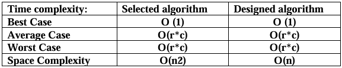
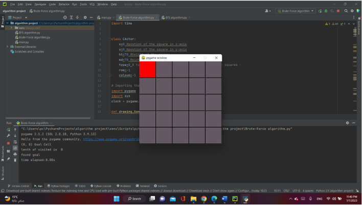
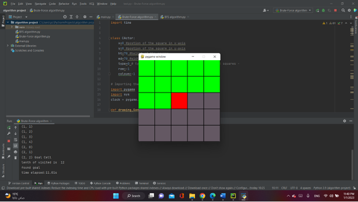
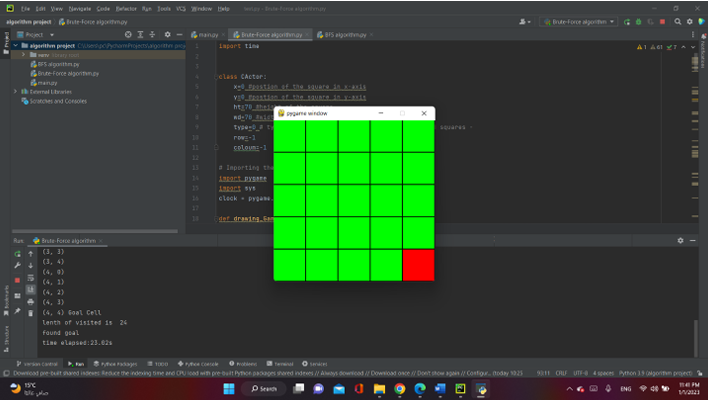
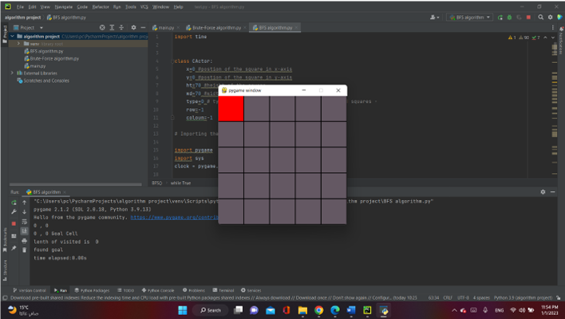
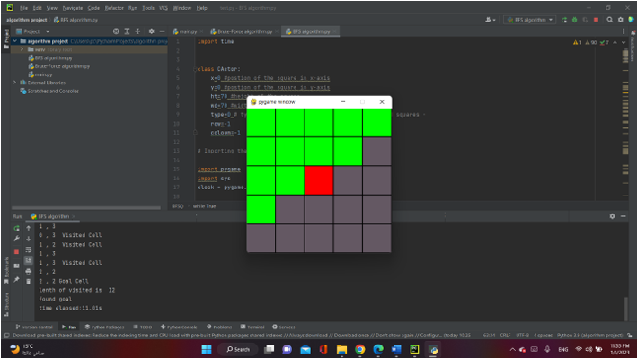
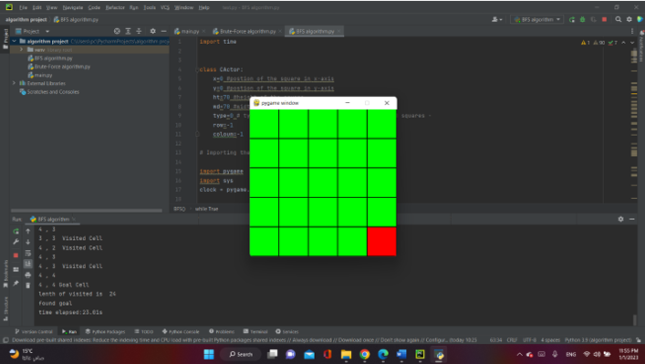

The problem is searching for certain cell in the two-dimensional 
array can be defined as an array of arrays. The 2D array is organized as 
matrices which can be represented as the collection of rows and 
columns.

The selected algorithm: 
Sequential Search, also called linear search, is the simplest of all 
searching algorithms. It is a brute-force approach to locating a single 
target value. It is used to find whether a particular element is present in 
the array or not by traversing every element in the array. While 
searching in the 2D array is exactly the same but here all the cells need 
to be traversed in this way, any element is searched in a 2D array.

The designed algorithm: 
Breadth-First Search Algorithm or BFS is the most widely utilized 
method. BFS is a graph traversal approach in which you start at a source 
node and layer by layer through the graph, analyzing the nodes directly 
related to the source node. Then, in BFS traversal, you must move on 
to the next-level neighbor nodes.

Implementation details: 
Python language was used to implement the two algorithms using PyCharm 
editor. I used the Pygame package to implement a GUI to show how the two 
algorithms work and the difference between them in reaching to the selected 
cell (It is clearer than console). 

 Analysis of the algorithms: 
 

Sequential Search:
Best case: Time complexity is O(1) because the selected cell is first cell.

Average case: Time complexity is O(r*c) because the selected cell needs two for 
loop to reach to it.  

Worst case: Time complexity is O(r*c) because the selected cell needs two for 
loop to reach to it.  

Breadth-First Search:
Best case: Time complexity is O(1) because the selected cell is first cell.

Average case: Time complexity is O(r*c) because the selected cell needs two for 
loop to reach to it. 

Worts case: Time complexity is O(r*c) because the selected cell needs two for 
loop to reach to it. 

Discussion of the result: 
Two algorithms are same in time complexity (best, average, worst case). but 
in space complexity designed algorithm better than selected algorithm 
because in selected algorithm it saves cells in 2d matrix so the complexity is 
O(n2) but in designed algorithm it saves cells in 1d list (fringe list) so the 
complexity is O(n).
